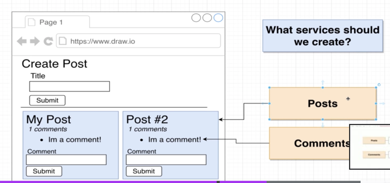
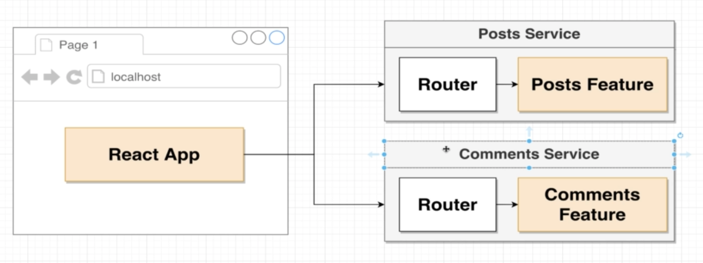
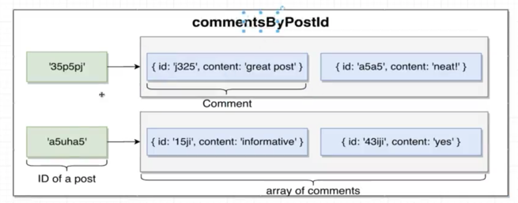

# Section 2. A mini-microservices app

## App Overview



## Project Setup


Initial app setup:
- generate react app using create-react-app  
- create express-based project for the posts service
- crete express-based project for the comments service 

`mkdir blog & cd blog`  

client folder:  
`npx create-react-app client`  

posts folder:  
`mkdir posts & cd posts`  
`npm init -y`  
`npm i express cors axios nodemon`  

comments folder:  
`mkdir posts & cd posts`  
`npm init -y`  
`npm i express cors axios nodemon`  

## Posts Service Creation
Methods:
- get
- post - create new post

## Implementing a Comments Service




```js
const express = require('express');
const bodyParser = require("body-parser")
const {randomBytes} =require("crypto");

const app = express();
app.use(bodyParser.json())

const commentsByPostId = {};

app.get('/posts/:id/comments', (req, res) => {
  res.send(commentsByPostId[req.params.id] || []);
})

app.post('/posts/:id/comments', (req, res) => {
  const commentId = randomBytes(4).toString('hex');
  const {content} = req.body;
  const comments = commentsByPostId[req.params.id] || [];
  comments.push({id: commentId, content})
  commentsByPostId[req.params.id] = comments;
  res.status(201).send(comments);
})

app.listen(4001, () => {
  console.log("Listening on 4000")
})
```
`npm start`

```json
  "scripts": {
    "start": "nodemon index.js"
  }
```

## React Project Setup
`npm i axios`

## Building Post Submission

Add bootstrap
_public/index.html_
```html
  <link href="https://cdn.jsdelivr.net/npm/bootstrap@5.2.0/dist/css/bootstrap.min.css" rel="stylesheet" integrity="sha384-gH2yIJqKdNHPEq0n4Mqa/HGKIhSkIHeL5AyhkYV8i59U5AR6csBvApHHNl/vI1Bx" crossorigin="anonymous">
```

## Handling CORS Errors
For posts and comments apps:  
`npm i cors`  

_posts/index.js_, _comments/index.js_  
```js
const cors = require("cors")

app.use(cors())
```
